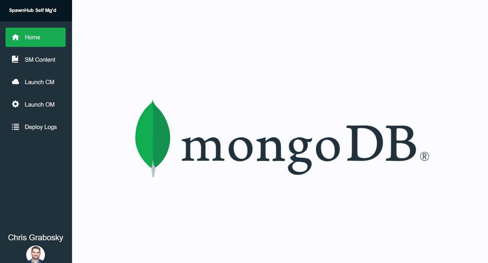
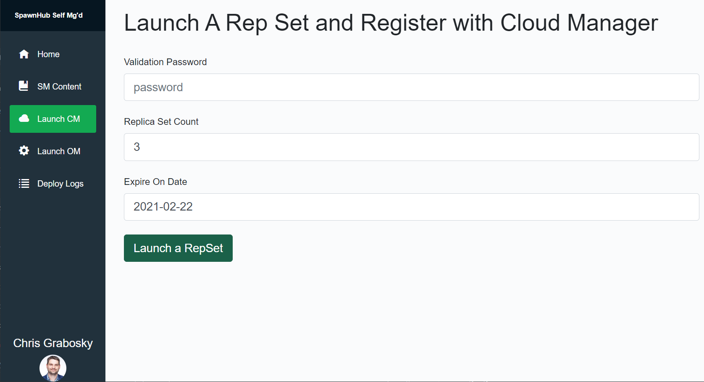
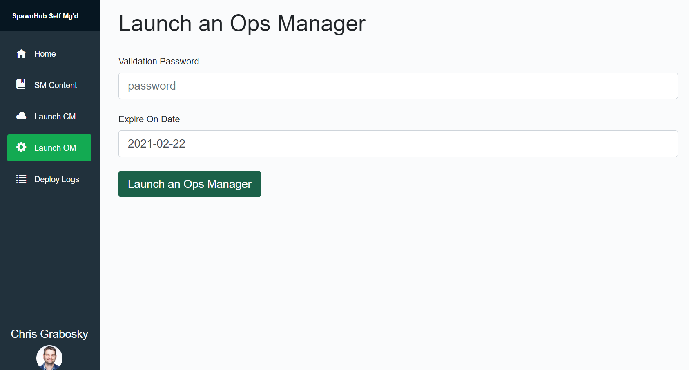
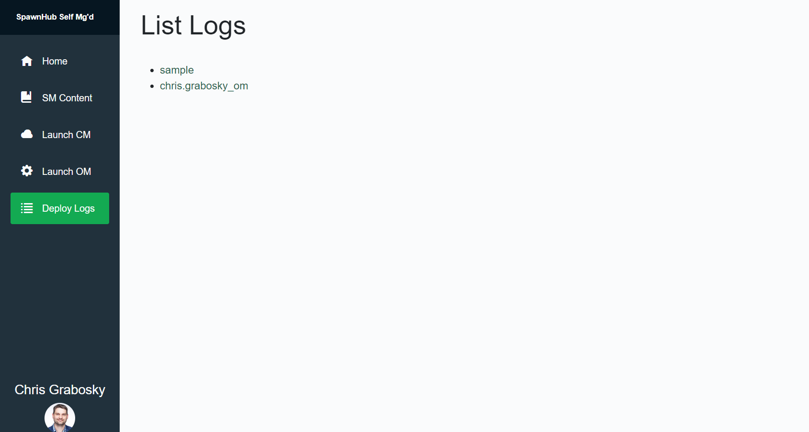
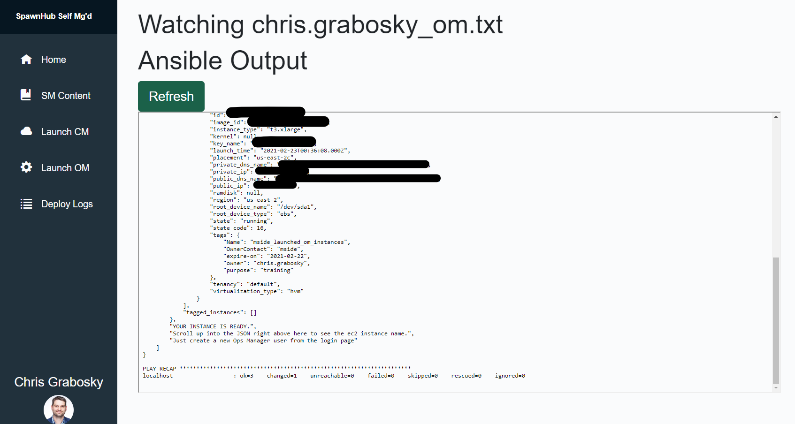

# MongoDB Ops/Cloud Manager Automation Example
An example for automating the deployment of new MongoDB replica sets using AWS, Ansible, and the Cloud/Ops Manager API

# Getting Started

## I'm a MongoDB Employee, using the SM UI
If you want to use the self-managed UI, visit the application, log in with your account. Upon logging in, you'll need the password protecting the deployment. Get it from the `#presales-self-managed` slack channel. 

You can also get this link off of mside.tech

## I want to run this on my own

Fun.

### Step 1: Edit config `deployConfig.json` 
There is a `deployConfig.sample.json` - rename this to `deployConfig.json` and change the following fields:

* `"projectID"` - This is the Cloud Manager / Ops Manager project id. You can get it from the project settings page.

* `"apiPublicKey"` - When you create an API key for Cloud Manager / Ops Manager, you will get a public and private key. Details on getting these keys are available in the documentation [here](https://docs.cloudmanager.mongodb.com/tutorial/configure-public-api-access/).

* `"apiPrivateKey"` - See above

*  `"rootURL"` - This is the root url for either Cloud Manager or Ops Manager. If you're using Cloud Manager it will be https://cloud.mongodb.com. If you're using Ops Manager it will vary based on your deployment.
  
* `"mmsGroupId"` - ID for the Cloud Manager / Ops Manager project we're working with.
  
* `"mmsApiKey"` - This is the API key for the Cloud Manager / Ops Manager agents. You can find this info [here](https://docs.cloudmanager.mongodb.com/tutorial/manage-agent-api-key/).
  
### Step 2: Credentials
Create in this root directory a `awsconfig` and `credentials` file which are your default aws config and credential files with your api key. Format for each are:

```
[default]
output = json
region = us-east-1
```

and
```
[default]
aws_access_key_id = <YOUR KEY ID>
aws_secret_access_key = <YOUR KEY>
```

respectively.

### Step 3: Build your container
Run the `build.sh` within the `SPAWNHUB` controller

### Step 4: Set up Ops Manager / Cloud Manager project
Make sure you create a user so you can connect to the replica set. Also, enable TLS on the security page. The CA File Path should be /etc/ssl/certs/mdbserverCA.pem. I like to set Client Certificate Mode to REQUIRE but this is up to you!

### Step 5: Run the ansible playbook!
While completing the UI, the way you can run this is as follows:

```
docker exec -it testqacmsh /bin/bash
cd /opt/AnsibleContent/
ansible-playbook playbook.yaml --extra-vars "ownerUserName='chris.grabosky'"
```

## Alt execution methodology
If your system is already prepped locally with all required files, etc, you can just `deployConfig.json` and then run `ansible-playbook playbook.yaml --extra-vars "ownerUserName='matthew.grogans'"` for example

# Screenshots








